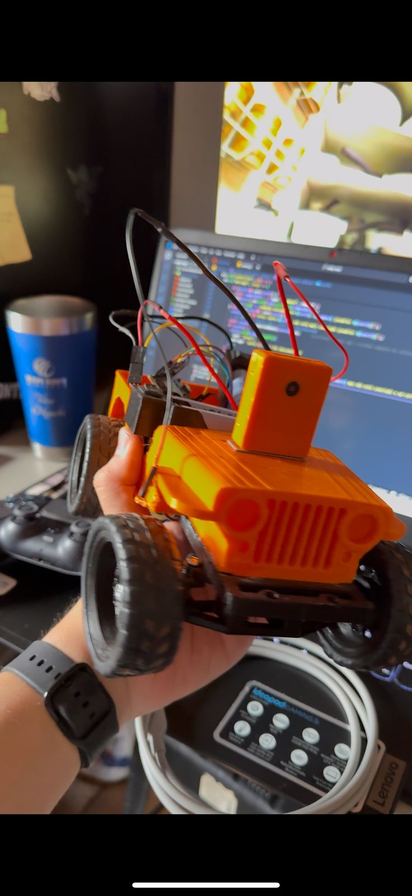

# Projeto Carro de Corrida UENP Race - SITe2025


Repositório do projeto **campeão da UENP Race**, uma competição de carrinhos controlados remotamente que ocorreu durante o **Seminário de Informática e Tecnologia 2025 (SITe2025)**.

O objetivo principal era criar um carrinho controlado remotamente via web, aplicando na prática conceitos de **Redes de Computadores**, especialmente os protocolos da camada de transporte como TCP e UDP.



## 🚀 Funcionalidades

- **Controle Remoto em Tempo Real:** Comandos enviados a partir de uma interface web.
- **Streaming de Vídeo:** Visualização da câmera do carrinho (ESP32-CAM) diretamente no navegador.
- **Comunicação de Baixa Latência:** Uso de **WebSockets** para uma conexão persistente e **UDP** para o envio de dados críticos (vídeo e comandos), priorizando a velocidade.
- **Suporte a Múltiplos Controles:** Pode ser controlado pelas setas do teclado ou por um gamepad (testado com um de PS5).
- **Hardware Customizado:** Chassi modelado e impresso em 3D, com eletrônica embarcada baseada no ESP32.

## 🏗️ Arquitetura do Projeto

A comunicação é baseada em um modelo cliente-servidor:

- **Carrinho (Cliente):** Um ESP32 que se conecta a uma rede Wi-Fi, estabelece uma conexão WebSocket com o servidor, envia o stream de vídeo e recebe os comandos de movimento.
- **Servidor (Intermediário):** Uma aplicação Node.js que gerencia a conexão WebSocket, serve a página de controle e faz a ponte entre o navegador e o carrinho.
- **Controlador (Navegador):** Uma interface web que exibe o vídeo, captura os inputs do usuário (teclado/gamepad) e os envia para o servidor.

```
[Controle (Gamepad/Teclado)] -> [Navegador Web] --(WebSocket)--> [Servidor Principal] --(WebSocket/UDP)--> [Carrinho (ESP32)]
```
```
[Câmera (ESP32-CAM)] --(UDP/WebSocket)--> [Servidor Principal] --(WebSocket)--> [Navegador Web]
```

## 🛠️ Tecnologias Utilizadas

### Hardware
- ESP32 (para processamento e conectividade)
- ESP32-CAM (para captura e streaming de vídeo)
- Ponte H L298N (para controle dos motores DC)
- Servo Motor SG90
- Baterias e Jumpers
- Chassi impresso em 3D

### Software
- **Carrinho:** C++ (utilizando o framework Arduino)
- **Servidor:** Node.js com Express e Socket.IO
- **Interface:** HTML, CSS e JavaScript

## 📂 Estrutura de Pastas

```
.
├── CARRINHO/           # Código fonte para o ESP32
├── CameraWebServer/    # Código fonte para o ESP32Cam
├── uenp-race/          # Código do servidor principal em Node.js
└── car-test/           # Servidor utilizado para testes iniciais
```

## ⚙️ Como Configurar e Executar

Siga os passos abaixo para rodar o projeto.

### Pré-requisitos
- [Node.js](https://nodejs.org/) instalado.
- [Arduino IDE](https://www.arduino.cc/en/software) com o [suporte para placas ESP32](https://docs.espressif.com/projects/arduino-esp32/en/latest/installing.html) instalado.

---

### 1. Configurando o Servidor Principal

Primeiro, clone o repositório:
```bash
git clone [https://github.com/vitorhhiguchi/UENP.git](https://github.com/vitorhhiguchi/UENP.git)
cd UENP/Redes/Jeep-SITe
```

Agora, configure e inicie o servidor:
```bash
# Navegue até a pasta do servidor
cd uenp-race

# Instale as dependências
npm install

# Inicie o servidor
node server.js
```
O servidor estará rodando no seu IP local, na porta especificada no código (`8080`). Anote o endereço de IP da sua máquina na rede local (ex: `192.168.1.10`).

---

### 2. Configurando o Carrinho (ESP32)

1.  Abra o arquivo `carrinho/carrinho.ino` na Arduino IDE.
2.  **Instale as Bibliotecas:** Vá em `Ferramentas > Gerenciar Bibliotecas` e instale as bibliotecas necessárias que estão nos `#include` do código (Ex: `WiFi`, `ArduinoWebSockets`, etc.).
3.  **Configure suas Credenciais:** No código, localize e altere as seguintes variáveis com as informações da sua rede:
    ```cpp
    const char* ssid = "NOME_DA_SUA_REDE_WIFI";
    const char* password = "SENHA_DA_SUA_REDE_WIFI";
    ```
4.  **Configure o IP do Servidor:** Insira o endereço de IP da máquina onde o servidor principal está rodando.
    ```cpp
    // Exemplo:
    webSocket.begin("192.168.1.10", 8080, "/");
    ```
5.  **Faça o Upload:**
    - Conecte seu ESP32 ao computador.
    - Em `Ferramentas > Placa`, selecione "ESP32 Dev Module" (ou a placa correspondente).
    - Selecione a porta COM correta.
    - Clique em "Carregar".

## 🎮 Como Usar

1.  Certifique-se de que o **servidor principal está rodando**.
2.  Ligue o carrinho. Você pode abrir o Monitor Serial na Arduino IDE para ver os logs de conexão.
3.  No seu navegador, acesse o endereço do servidor: `http://[IP_DO_SEU_SERVIDOR]:8080`.
4.  A interface de controle será carregada. Agora você pode:
    - Usar as **setas do teclado** para mover o carrinho.
    - Conectar um **gamepad** ao computador para um controle mais preciso.

## 📜 Licença

Este projeto está sob a licença MIT. Veja o arquivo `LICENSE` para mais detalhes.

---

Feito com 💙 por **Vitor H. Higuchi**